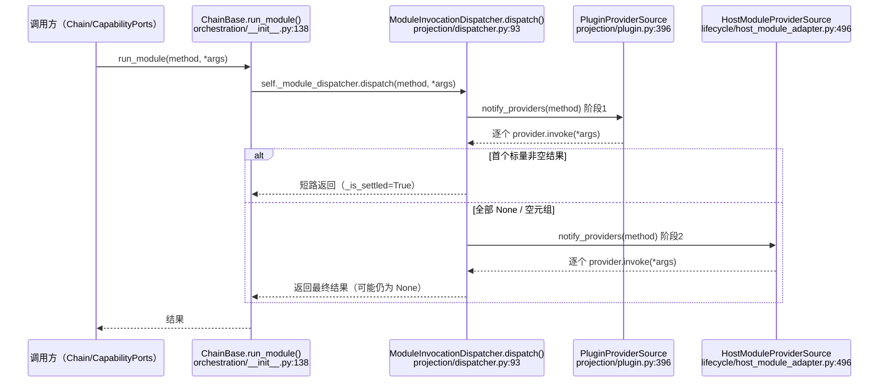
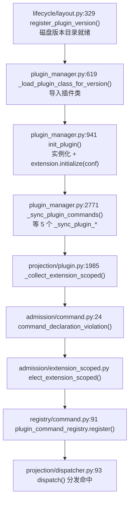
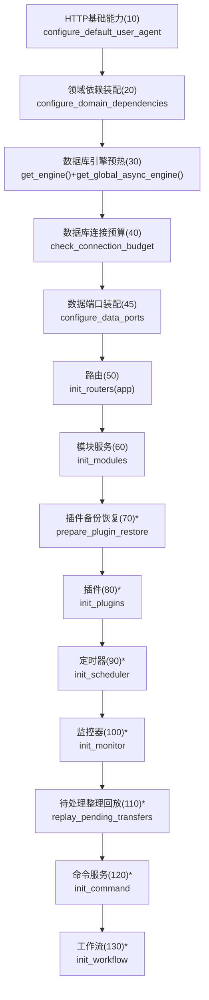
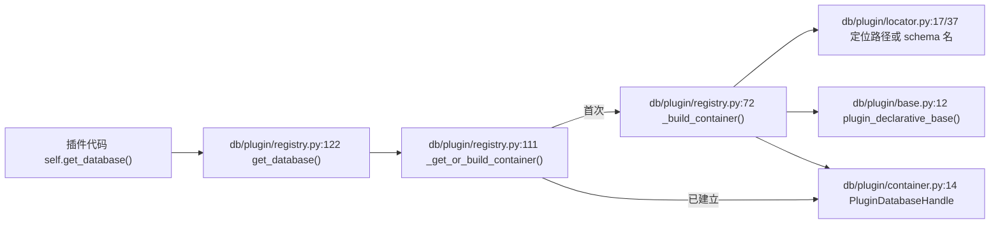
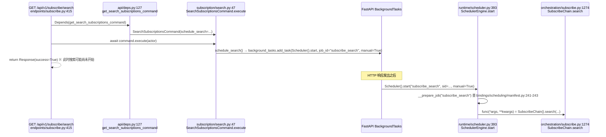
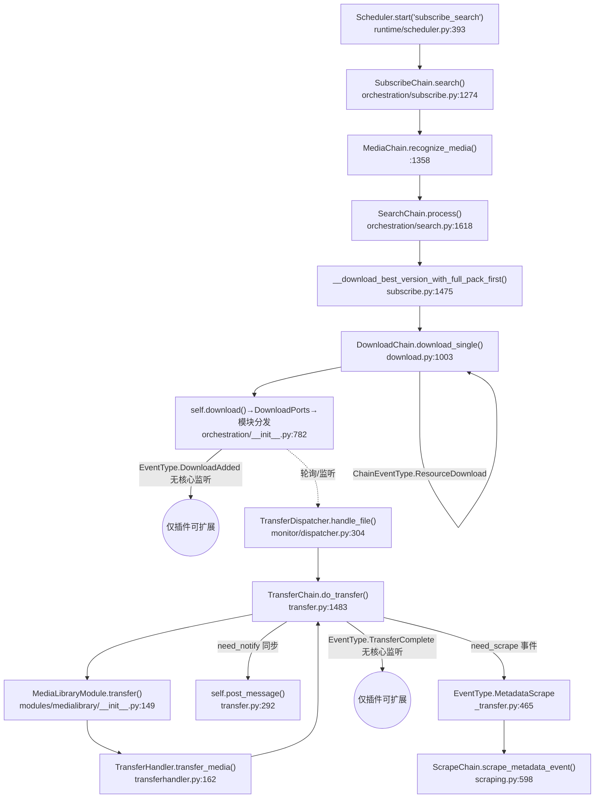

# MoviePilot v3 底层逻辑调用图

本文档记录的是**运行时调用事实**，不是使用说明。全部跳转均来自对 `app/` 目录源码的实际阅读，标注格式为 `文件路径:行号`，行号为撰写时读到的真实行号。分层依赖的权威定义见
`tests/test_architecture_dependencies.py:9`（`PACKAGE_LAYERS`）。

分层现状：`app/foundation` → `app/schemas`/`app/domain` → `app/runtime` → `app/db`/`app/adapters` →
`app/application` + `app/modules` → `app/api`/`app/agent`/`app/monitor`/`app/workflow`/`app/scheduler`；
组合根 `app/startup`，插件稳定导入面 `app/sdk`。

---

## 目录

1. [HTTP 入口链](#1-http-入口链)
2. [四级分发内核](#2-四级分发内核)
3. [扩展注册五阶段](#3-扩展注册五阶段)
4. [十二族声明式注册](#4-十二族声明式注册)
5. [启动生命周期](#5-启动生命周期)
6. [持久化路径](#6-持久化路径)
7. [调度与事件](#7-调度与事件)
8. [端到端业务流：订阅→搜索→下载→整理→刮削→通知](#8-端到端业务流订阅搜索下载整理刮削通知)
9. [调用图中的反直觉之处](#9-调用图中的反直觉之处)

---

## 1. HTTP 入口链

### 1.1 应用装配

`app/factory.py:290` `create_app()` 是组合根：

- `app/factory.py:298` 把 `lifespan=lifespan` 传给 `FastAPI(...)`，`lifespan` 来自
  `app/startup/lifecycle/__init__.py:283`。
- `app/factory.py:308` `_app.router.route_class = ResponseAPIRoute`：主程序静态路由统一走
  `app/api/response.py` 的响应封装路由类；插件动态路由会显式覆盖为原生 `APIRoute`。
- `app/factory.py:340-355` `configure_plugin_routes(FastAPIDynamicRouteRegistry(...))`：把插件 API
  的动态挂载/卸载委托给 `app/application/plugin/routes.py`，避免 `app/api/endpoints` 反向依赖
  `app/factory.py`。
- 模块级 `app/factory.py:361` `app = create_app()`：所有组合根装配副作用在导入期发生一次。

### 1.2 生命周期驱动路由注册

`app/startup/lifecycle/__init__.py:283` `lifespan(app)` 在 `yield` 之前，按
`app/startup/lifecycle/components.py:136` `build_lifecycle_components(app)` 返回的 14 个
`LifecycleComponent` 排序执行。其中"路由"组件：

```python
# app/startup/lifecycle/components.py:176-182
LifecycleComponent(
    name="路由",
    dependencies=("数据端口装配",),
    start=lambda: init_routers(app),
    start_order=50,
    start_timeout_seconds=30,
),
```

`app/startup/routers_initializer.py:6` `init_routers(app)` 直接聚合端点路由（不再先建兼容路由器再克隆）：

```python
# app/startup/routers_initializer.py:10-19
from app.api.router_specs import API_V1_ROUTER_SPECS
for spec in API_V1_ROUTER_SPECS:
    app.include_router(spec.router, prefix=f"{settings.API_V1_STR}{spec.prefix}", tags=list(spec.tags))
app.include_router(arr_router, prefix="/api/v3")       # Radarr/Sonarr 兼容
app.include_router(cookie_router, prefix="/cookiecloud")
```

`app/api/router_specs.py:54` `API_V1_ROUTER_SPECS` 是一张纯数据表，`RouterSpec(subscribe.router, "/subscribe", ("subscribe",))`
在 `app/api/router_specs.py:63`，其余 29 个端点模块同理逐条声明。

### 1.3 端点 → 编排层：两种真实存在的调用形态

同一个 `app/api/endpoints/subscribe.py` 文件里并存两种模式，均已核实：

**形态 A：端点直接同步调用编排层**

```python
# app/api/endpoints/subscribe.py:65-77（start_subscribe_add 辅助函数）
SubscribeChain().add(...)
```

**形态 B：端点只提交后台任务，真正的编排调用发生在 HTTP 响应返回之后**

```python
# app/api/endpoints/subscribe.py:415-429
@router.get("/search", ...)
async def search_subscribes(
    command: SearchSubscriptionsCommand = Depends(get_search_subscriptions_command),
    ...
):
    await command.execute(SubscribeSearchActor(...))
    return _SchemaResponse(success=True)
```

`get_search_subscriptions_command`（`app/api/deps.py:127-145`）把调度延迟到
`BackgroundTasks`：

```python
# app/api/deps.py:132-140
def schedule_search(subscribe_id, state) -> None:
    background_tasks.add_task(
        Scheduler().start, job_id="subscribe_search", sid=subscribe_id, state=state, manual=True,
    )
```

`SearchSubscriptionsCommand.execute`（`app/application/subscription/search.py:47-70`）只做权限校验后调用
`self._schedule_search(...)`；真正触达 `SubscribeChain().search(...)` 要等到调度引擎在响应之后执行
`Scheduler().start()`（细节见 §8）。**端点返回 200 时，搜索可能尚未开始。**

### 1.4 端点 → 编排层 → 模块分发（Mermaid）

```mermaid
flowchart LR
    A["app/factory.py:290 create_app()"] --> B["app/startup/lifecycle/__init__.py:283 lifespan()"]
    B --> C["app/startup/lifecycle/components.py:179 start=init_routers(app)"]
    C --> D["app/startup/routers_initializer.py:6 init_routers()"]
    D --> E["app/api/router_specs.py:54 API_V1_ROUTER_SPECS"]
    E --> F["app/api/endpoints/subscribe.py:415 search_subscribes()"]
    F -->|形态B：延迟| G["app/api/deps.py:132 background_tasks.add_task(Scheduler().start)"]
    F -.->|形态A：立即| H["app/api/endpoints/subscribe.py:77 SubscribeChain().add()"]
    H --> I["app/application/orchestration/__init__.py:138 ChainBase.run_module / 175 broadcast / 203 multicast / 232 unicast"]
    I --> J["app/runtime/extensions/projection/dispatcher.py:46 ModuleInvocationDispatcher"]
```



---

## 2. 四级分发内核

这是全项目最关键的机制，位于两层：`app/application/orchestration/__init__.py`（`ChainBase` 门面）
调用 `app/runtime/extensions/projection/dispatcher.py`（`ModuleInvocationDispatcher`，真正的算法）。
非 Chain 场景（按域组合能力端口的服务）改走
`app/application/orchestration/ports/dispatch.py:125` 的 `ModuleCapabilityDispatch`，两者共享同一个
`ModuleInvocationDispatcher`。

### 2.1 四种原语的语义（`ChainBase`，`app/application/orchestration/__init__.py`）

| 原语 | 定义位置 | 语义 |
|---|---|---|
| `run_module` | `:138-152` | 按发行方式（插件先、宿主模块后）分阶段接力，先得到的**标量**答案短路后续阶段；是 `_PluginBase` 冻结契约的一部分，插件经 `self.chain` 调用 |
| `broadcast` | `:175-187` | 通知全部提供者，不收集结果，互不影响，各自独立捕获异常 |
| `multicast` | `:203-215` | 收集能力族内**全部**非空答案，返回列表 |
| `unicast` | `:232-244` | 能力族内仲裁**单一**答案，首个非空结果即最终答案 |
| `pipeline` | `:261-276` | 按提供者顺序接力，每个提供者在上一个的产出上继续增强 |

五者均有 `async_*` 版本（`:154`、`:189`、`:217`、`:246`、`:278`），支持同步/异步方法混合调用。

`ChainBase.__init__`（`:50-78`）在构造时装配调度器：

```python
# app/application/orchestration/__init__.py:67-73
self._module_dispatcher = context.module_dispatcher_factory(
    module_catalog=self.modulemanager,
    plugin_catalog=self.pluginmanager,
    plugin_error_handler=error_reporter.handle_plugin_error,
    system_error_handler=error_reporter.handle_system_error,
    rate_limit_handler=error_reporter.handle_rate_limit_error,
)
```

`module_dispatcher_factory` 由启动组合根注入为 `ModuleInvocationDispatcher`
（`app/startup/modules_initializer.py:103`）。

### 2.2 真正的算法：`ModuleInvocationDispatcher`（`app/runtime/extensions/projection/dispatcher.py:46`）

**让出协议**（`:82-91`）：

```python
@staticmethod
def is_valid_empty(result: Any) -> bool:
    """判断结果是否为空，None 与全 None 元组都视为未认领。"""
    if isinstance(result, tuple):
        return all(value is None for value in result)
    return result is None
```

即：`None` 未认领；全 `None` 的元组未认领；但 `[]`、`False`、`{}` **不是**空——它们被视为"已认领并短路/计入结果"。

**提供者来源与优先顺序**（`:70-74`）：

```python
self._sources: tuple[ExtensionProviderSource, ...] = (
    PluginProviderSource(plugin_catalog),      # 插件（市场扩展）
    HostModuleProviderSource(module_catalog),  # 宿主内建模块
    *extra_sources,
)
```

插件永远先于宿主内建模块被通知/仲裁。

**`dispatch()`（同步 `run_module` 的实现，`:93-108`）**：按 `self._sources` 顺序分阶段调用
`_execute_chain`（`:327-364`），阶段内部规则：

- 当前结果为空 → 用提供者返回值替换（首次填充）；
- 结果非空且提供者声明 `relays_result` 且签名匹配 → 把结果传给提供者做接力增强；
- 结果是 `list` → 提供者返回值若也是 `list` 则 `extend`（合并语义）；
- 否则 → `break`（标量已经"定型"，不再继续本阶段）。

阶段之间用 `_is_settled()`（`:253-259`：非空且不是 `list`）判断是否整体短路，命中即
`break` 出跨阶段循环（`:106-107`）。`async_dispatch()`（`:110-125`）与 `_async_execute_chain()`
（`:366-403`）复刻同一套规则，唯一区别是 `_async_call`（`:462-471`）对协程直接 `await`，
对同步函数经 `run_in_threadpool`（`app/runtime/execution.py`）移出事件循环。

**`multicast`/`unicast`/`pipeline`/`broadcast`**（`:127-241`）比 `dispatch` 简单得多：

- `multicast`（`:149-162`）遍历 `_answer_providers`，非空结果一律追加进列表，**不短路**；
- `unicast`（`:179-191`）遍历同一批提供者，**首个**非空结果立即返回；
- `pipeline`（`:207-222`）用 `initial` 起手，每个提供者的非空产出替换当前结果继续往下传，
  提供者返回空则保留上一轮产出；
- `broadcast`（`:127-136`）纯通知，不判空不收集。

**异常隔离**（`:279-301`，`_invoke`）：单个提供者抛出 `RateLimitExceededException` 走
`_report_rate_limit`（限流日志，不告警）；抛其它异常走 `_report_fault`——按 `provider.fault_scope`
（`ExtensionFaultScope.PLUGIN` 或 `.HOST`）分流到不同的错误上报策略（`ModuleErrorReporter`，
`app/application/orchestration/ports/dispatch.py:49-123`），单个提供者出错不影响同批次其它提供者。

### 2.3 提供者来源的两种实现（同步/异步分野发生在这里）

- `PluginProviderSource`（`app/runtime/extensions/projection/plugin.py:396-482`）：`_providers()`
  （`:416-448`）每次调用都执行 `self._catalog.get_plugin_modules()`（即时快照，**不缓存**，见 §9）；
  非映射类型的畸形声明在此处构造一个"调用即抛 `TypeError`"的占位提供者（`:450-466`），
  把坏插件的错误配置也纳入统一的故障上报通道，不让它击穿同批次其它插件。
- `HostModuleProviderSource`（`app/runtime/extensions/lifecycle/host_module_adapter.py:496-540`）：
  底层由 `ModuleManager._capability_index_snapshot()`（`app/runtime/extensions/module_manager.py:299-318`）
  提供，这是一个**按 `_running_generation` 代际号缓存的能力索引**，只有运行模块集合变化时才重建
  （`:278-297` `_build_capability_index`）。

### 2.4 分发时序（Mermaid）



---

## 3. 扩展注册五阶段

`app/runtime/extensions/` 下五个子包并非严格的线性流水线，实际运行时顺序是：

```
lifecycle（发现/导入代码、维护磁盘布局）
   → registry.plugin.PluginRegistry（持有运行态实例，"原材料"）
       → 每次需要能力清单时：projection ⇄ admission ⇄ contract（现算现查，见 §9）
           → registry.{command,filter_rule,meta_parser,service_instance,storage}（登记裁决后的结果，"派生态"）
```

### 3.1 contract（声明定义）

`app/runtime/extensions/contract/declaration.py`（918 行）定义每族声明的**取值访问器**函数，如
`declaration_command_identity`、`declaration_filter_rule_conditions`、
`declaration_schedule_trigger`（在 `app/runtime/extensions/projection/plugin.py:16-42` 被批量导入）。
`app/runtime/extensions/contract/module_method.py` 提供 `get_module_method_contract(method)`，
被 `ModuleInvocationDispatcher._log_contract`（`app/runtime/extensions/projection/dispatcher.py:243-251`）
在每次分发前调用，记录该方法命中的能力族契约。

### 3.2 admission（注册期契约校验与裁决）

`app/runtime/extensions/admission/` 下每个族一个 `*_declaration_violation(declaration)` 函数，
合规返回 `None`，否则返回违规原因字符串。例如：

- `app/runtime/extensions/admission/command.py:24` `command_declaration_violation`
- `app/runtime/extensions/admission/filter_rule.py:27` `filter_rule_declaration_violation`，`:67` `filter_rule_group_declaration_violation`
- `app/runtime/extensions/admission/service_instance.py:57` `service_instance_declaration_violation`

`app/runtime/extensions/admission/extension_scoped.py:elect_extension_scoped` 负责跨插件/跨实例
的最终裁决（同一标识多方声明时选出唯一胜出者）。

`admission/service_instance_requirement.py` 的模块注释直接点破了执行时机（非注册期一次性，而是
每次投影都重跑，见 §9 的证据链）：

> "装载期跑一次，而是每次投影都重跑（见 `projection/plugin.py` 的 `provided_actions`
> 与 `provided_dashboards`）。"（`app/runtime/extensions/admission/service_instance_requirement.py:9-10`）

### 3.3 registry（登记持有态）

七个持久化登记表，均提供显式 `register()`/`unregister_owner()`：

| 登记表 | 定义位置 | 关键方法 |
|---|---|---|
| `PluginRegistry` | `app/runtime/extensions/registry/plugin.py:9` | `running`(:30)、`instance`(:50)、`remove_instance`(:140) —— 持有**原始插件实例**本身 |
| `PluginCommandRegistry` | `app/runtime/extensions/registry/command.py:62` | `register`(:91)、`unregister_owner`(:113) |
| `PluginFilterRuleRegistry` | `app/runtime/extensions/registry/filter_rule.py:63` | `register`(:94)、`unregister_owner`(:128) |
| `MetaParserRegistry` | `app/runtime/extensions/registry/meta_parser.py:132` | `register`(:140)、`run_meta_parsers`(:303) |
| `ServiceInstanceRegistry` | `app/runtime/extensions/registry/service_instance.py:204` | `register`(:212)、`unregister_owner`(:272) |
| `StorageBackendRegistry` | `app/runtime/extensions/registry/storage.py:209` | `register`(:219)、`unregister`(:258) |
| `ServiceFamilyRegistry` | `app/runtime/extensions/registry/service_family.py:57` | `register`(:65)、`find`(:111) |

### 3.4 projection（查询期投影）

`PluginProjection` 类（`app/runtime/extensions/projection/plugin.py:485`）是插件能力的统一查询入口，
12 个 `provided_*` 方法（见 §4）大多委托给通用算法
`_collect_extension_scoped`（`:1985-2045`）：

```python
# app/runtime/extensions/projection/plugin.py:2012-2038（节选）
declared = getattr(plugin, hook)() or []          # 1. 取用声明（contract 访问器隐含在 hook 内）
for item in declared:
    violation = violation_of(item)                 # 2. admission 校验
    if violation:
        ...跳过该条...
    identity = identity_of(item) if unique_within_instance else None
    if identity is not None and identity in claimed:
        ...同实例内重复声明，跳过...
    accepted.append(item)
result[extension_id] = accepted
return self._narrow_to_query(
    elect_extension_scoped(result, identity_of, subject=subject, hook=hook, log=self._logger),  # 3. 跨实例裁决
    pid,
)
```

单条声明违规只跳过该条，不影响同一实例的其余声明；单个实例取声明抛异常只跳过该实例
（`:2013-2017`）。

### 3.5 lifecycle（发现加载）

`app/runtime/extensions/lifecycle/` 处理插件在磁盘上的版本目录与实例路径，不涉及 Python 对象生命周期：

- `layout.py:41` `plugin_version_dir_name`、`:85` `plugin_version_dirs`、`:260` `migrate_legacy_plugin_layout`、`:329` `register_plugin_version`
- `paths.py:29` `plugin_instance_path(plugin_id, instance_id, kind)`
- `host_module_adapter.py:350` `build_host_module_registry()`：构造**宿主内建模块**（非插件）的能力登记表

插件 Python 类的实际导入/实例化/`sync()` 落在 `app/runtime/extensions/plugin_manager.py`
（不在 `lifecycle/` 子包内）：`_load_plugin_class_for_version`（`:619`）、`sync()`（`:1736`）、
`init_plugin()`（`:941`）。

### 3.6 一个插件从被发现到能力可被分发命中的完整路径



---

## 4. 十二族声明式注册

`app/sdk/extension.py` 的 `_PluginBase`（`:65`）定义 12 个 `provides_*` 钩子，是插件对外的稳定契约面。

| # | SDK 钩子（`app/sdk/extension.py`） | admission 校验（`app/runtime/extensions/admission/`） | 持久 registry | projection 查询方法（`projection/plugin.py`） | 主要消费方 |
|---|---|---|---|---|---|
| 1 | `provides_commands` `:166` | `command.py:24` | `registry/command.py:62` `PluginCommandRegistry` | `:536 provided_commands` / `:614 commands()` | `plugin_manager.py:2771 _sync_plugin_commands` → `register()`(:2791) |
| 2 | `provides_schedules` `:266` | `schedule.py:49` | 无独立 registry（并入 `services()` 返回给 UI/调度） | `:693 provided_schedules` / `:797 services()` | `plugin_manager.py:2898 get_plugin_services` |
| 3 | `provides_dashboards` `:339` | `dashboard.py:19` | 无 registry，纯查询期计算 | `:2079 provided_dashboards` | `plugin_manager.py:3118`（仪表盘渲染时现查） |
| 4 | `provides_modules` `:410` | `module.py:42` | 无 registry，纯查询期计算 | `:852 provided_modules` / `:888 modules()` | `plugin_manager.py:2900 get_plugin_modules()` → **每次分发都调用**（见 §9） |
| 5 | `provides_channel_capabilities` `:454` | `channel.py:15` | 渠道能力登记（经 `plugin_manager._sync_channel_capabilities`） | `:1669 provided_channel_capabilities` | `plugin_manager.py:2443 _sync_channel_capabilities` |
| 6 | `provides_service_instances` `:474` | `service_instance.py:57` + `service_instance_requirement.py` | `registry/service_instance.py:204` `ServiceInstanceRegistry` | `:1787 provided_service_instances` | `plugin_manager.py:2504 _register_declared_service_instances` |
| 7 | `provides_meta_parsers` `:601` | `meta_parser.py:28` | `registry/meta_parser.py:132` `MetaParserRegistry` | `:1864 provided_meta_parsers` | `plugin_manager.py:2696 _sync_plugin_meta_parsers` |
| 8 | `provides_filter_rules` `:636` | `filter_rule.py:27` | `registry/filter_rule.py:63` `PluginFilterRuleRegistry` | `:1949 provided_filter_rules` | `plugin_manager.py:2736 _sync_plugin_filter_rules` |
| 9 | `provides_filter_rule_groups` `:671` | `filter_rule.py:67` | 同上 | `:1967 provided_filter_rule_groups` | 同上（`:2752`） |
| 10 | `provides_media_sources` `:719` | `media_source.py:22` | 无 registry，纯查询期计算 | `:1074 provided_media_sources` | `projection/media_source_routing.py` 供搜索/元数据路由现查 |
| 11 | `provides_actions` `:782` | `action.py:19` | 无 registry，纯查询期计算 | `:1260 provided_actions` | 工作流引擎构建可选动作面板时现查 |
| 12 | `provides_agent_tools` `:827` | `agent_tool.py:62`（另有 `:48 agent_tool_declaration_name`） | 无 registry，带**显式缓存失效计数器** | `:1903 provided_agent_tools` | `plugin_manager.py:2992` + `:978 clear_plugin_agent_tools_cache()` 在 `init_plugin()` 末尾强制失效 |

七个族（1、6、7、8、9 及底层 `storage`/`plugin` 两个非 SDK 钩子的登记表）有持久 registry；
其余六个族（2、3、4、5、10、11）**没有**持久登记表，每次查询都重新执行
`admission → 裁决` 全过程（详见 §9）。

---

## 5. 启动生命周期

### 5.1 `app/startup/` initializer 与 `bindings/` 的分界

`app/startup/bindings/__init__.py:1-13` 的模块文档明确给出判据：

> "初始化动作在组合根指定的时刻被执行一次，执行完不再被读取；绑定表由消费方自己决定何时读、
> 可重复读，读到的条目由消费方在更晚的时刻执行。"

即：`*_initializer.py`（如 `routers_initializer.py`、`modules_initializer.py`）是"读一次就扔"的启动动作；
`bindings/`（如 `bindings/database.py`、`bindings/scheduling/manifest.py`）是"数据表"，被消费方
（调度器、数据库治理门面）反复读取，读到的条目在更晚的时刻才真正执行。

### 5.2 生命周期组件顺序（`app/startup/lifecycle/components.py:136-272`）

`build_lifecycle_components(app)` 返回 14 个组件，`start_order` 与 `stop_order` **各自独立编号**，
不是彼此的镜像：


（`*` 标记的组件 `mode=NORMAL_ONLY`，安全模式 `MOVIEPILOT_SAFE_MODE` 下跳过，见
`app/startup/lifecycle/components.py:41-43` `LifecycleComponent.enabled()`）

`数据库引擎预热`（30）、`数据库连接预算`（40）、`数据端口装配`（45）、`领域依赖装配`（20）
**均未声明 `stop` 回调**（`stop=None`），即这四个组件在应用关闭时不执行任何显式清理动作。

### 5.3 `lifespan()` 的关键细节（`app/startup/lifecycle/__init__.py:283-357`）

- `:309-327` 按 `start_order` 顺序同步 `await` 执行全部启用组件的 `start`；
- `:331-333` **随后**才把 `init_extra()`（插件同步、重启收尾、用量上报）包装成
  `asyncio.create_task(...)` 派发——这是一个后台任务，与 `yield` 之后开始接受请求
  **并发执行**，不阻塞启动；
- `:334-336` `yield` 把控制权交还 FastAPI；
- 关闭时（`:337-357`）先 `await sync_plugins_task`（等后台插件同步收尾），再按 `stop_order`
  执行各组件的 `stop`，最后关日志（`LoggerManager.shutdown()`，`:357`）。

### 5.4 `init_modules()` 内部顺序（`app/startup/modules_initializer.py:379-434`）

`configure_host_ports()`(:384) → `configure_module_runtime`(:386) → `configure_plugin_runtime`(:387) →
`configure_runtime_data_providers()`(:389，把 DB Oper 注入 Runtime/Adapter 端口) →
`configure_database_governance(build_database_governance())`(:391，引用 `bindings/database.py:26`) →
`init_managed_resources()`(:393) → `configure_wallpaper_services()`(:395) →
`configure_chain_runtime_context_provider(build_default_chain_runtime_context)`(:397，见 §2.1) →
`ModuleManager()`(:413，触发宿主模块加载) → `configure_dispatch_host_ports()`(:415) →
`EventManager().start()`(:417) → `init_agent()`(:430) → `check_auth()`(:434)。

---

## 6. 持久化路径

### 6.1 `app/db/oper/*`：全局单例 DB 上的领域仓储

每个业务域一个 `*Oper` 类，继承 `DbOper`，共享同一个全局引擎/会话工厂
（`app/db/engine.py`、`app/db/session.py`）。示例：`SubscribeOper`
（`app/db/oper/subscribe.py:88`），方法含 `add`(:115)、`exists`(:154)、`get`(:186)、
`list`(:313)、`delete`(:355)、`update`(:391)。

### 6.2 `app/db/plugin/`：插件自管理表（绕开全局单例）

- `locator.py:1` 模块文档"不持有任何状态"；`:17` `sqlite_db_path(plugin_id, instance_id)`，
  `:37` `postgres_schema_name(plugin_id, instance_id)`——按 `(plugin_id, instance_id)` 纯计算
  SQLite 文件路径 / PostgreSQL schema 名，不接触 SQLAlchemy 对象。
- `base.py:12` `plugin_declarative_base(...)`：为每个插件生成**独立的** `DeclarativeBase`，
  插件的 ORM 模型不与宿主共享 `Base`，避免表名/元数据冲突。
- `container.py:14` `class PluginDatabaseHandle`：持有一个 `(plugin_id, instance_id)` 的引擎、
  会话工厂，以及按所有权决定的释放策略。
- `registry.py:1` 模块文档"插件数据库容器注册表：按 `(plugin_id, instance_id)` 管理容器的建立、
  建表与释放"；`:48` `declare_models(plugin_id, instance_id, base)`、
  `:60` `declare_migrations(plugin_id, instance_id, directory)`、
  `:111` `_get_or_build_container()`（惰性建立并缓存）、
  `:122` `get_database(plugin_id, instance_id=DEFAULT_INSTANCE_ID)`——插件获取自己数据库句柄的
  唯一公开入口，全程不经过 `app/db/session.py` 的全局 `SessionFactory`。

容器生命周期与插件停止绑定：`plugin_manager.py:1051`/`:1088` 在插件全部实例停止后调用
`_plugin_database_release(plugin_id)` 释放连接（不销毁库文件；销毁只在显式删除插件数据的路径触发）。



---

## 7. 调度与事件

### 7.1 调度器组合（`app/scheduler/composition.py:19`）

```python
class Scheduler(SchedulerEngine, AgentTaskScheduling, WorkflowScheduling,
                PluginScheduling, ConfigReloadMixin, metaclass=SingletonClass):
```

`init()`（`:82-119`）顺序：`self.stop()`(:88) → 非 DEV 才继续 →
`_reconcile_agent_task_interruptions()`(:95，对账上个进程未收口的 Agent 任务) →
新建 `BackgroundScheduler`(:99) →
`for job in build_host_jobs(user_auth=...): self._register_job(job)`(:105-106，引用
`app/startup/bindings/scheduling/manifest.py`) →
`init_workflow_jobs()`(:109) → 条件性 `init_agent_task_jobs()`(:112-113) →
`init_plugin_jobs()`(:116) → `self._scheduler.start()`(:119)。

`app/runtime/scheduler.py:73` `SchedulerEngine` 是纯引擎，只认识 `ScheduledJob`/`ScheduledTrigger`
两个原语（`:32`、`:51`），不认识任何业务（业务清单由 `bindings/scheduling/` 提供，见
`app/startup/bindings/scheduling/__init__.py:1-6` 模块文档）。

`SchedulerEngine.start(job_id, *args, **kwargs)`（`:393-461`）按 `job_id` 查表（`__prepare_job`,
:130/:420），再按 `func` 是否协程 / 是否 `run_in_process` / 普通同步函数三条路径分别执行
（`:439-451`），普通同步函数**在调用方线程内直接跑**，不自动移入线程池。

`app/startup/bindings/scheduling/manifest.py:build_host_jobs()` 是业务作业的数据表，示例条目
（均为 `SubscribeChain()` 方法引用）：`check`(:237)、`subscribe_search`(:241-243)、
`new_subscribe_search`(:252-254)、`refresh`(:261)、`follow`(:267)、`cache_calendar`(:345)。

`app/startup/scheduler_initializer.py:1-5` 在**模块导入期**（而非某个 `init_*` 调用期）就执行
`register_scheduler_class(Scheduler)`，向 `app/application/scheduling.py` 门面登记，
"保证工具调用时不依赖静态边"。

### 7.2 事件总线（`app/runtime/event/` + `app/runtime/events.py`）

`EventDispatcher`（`app/runtime/event/dispatch.py:36`）是无状态执行器，只按
`EventRegistry` 给出的订阅快照跑：

- `dispatch_chain(event)`（`:57-80`）：同步、按优先级顺序执行**链式**事件，遇到
  `registry.is_handler_enabled(handler)` 为假的处理器直接跳过；
- `EventManager`（`app/runtime/events.py:72`）提供同步 `send_event`（`:189`）与异步
  `async_send_event`（`:207`），后者内部有独立的 `__trigger_chain_event_async`（`:304`）/
  `__dispatch_chain_event_async`（`:327`）/`__safe_invoke_handler_async`（`:365`）路径；
- `register(etype, ...)`（`:449`）是处理器注册装饰器，实例示例：
  `app/application/orchestration/scraping.py:598`
  `@eventmanager.register(EventType.MetadataScrape) def scrape_metadata_event(self, event)`。

**处理器解析白名单**（反直觉，见 §9）：`app/startup/modules_initializer.py:188-233`
`get_host_event_handler_factories()`/`configure_host_event_handler_resolver()` 显式登记
`Command`、`DownloadChain`、`Scheduler`（同时承载 `PluginScheduling`）、`ScrapingChain`、
`SearchChain`、`SiteChain`、`SubscribeChain`、`WorkflowChain` 八个宿主类；事件总线
**不会**对未登记的类临时 `owner_class()` 构造实例（`:214` 注释："禁止事件总线按类名临时构造未知对象"）。

---

## 8. 端到端业务流：订阅→搜索→下载→整理→刮削→通知

两个入口在调度层重新汇合到同一个函数引用：



另一入口：`bindings/scheduling/manifest.py:241-243` 把同一个 `SubscribeChain().search`
注册为周期性 APScheduler 作业，由 `Scheduler.init()`（`app/scheduler/composition.py:105-106`）
登记，到点由 APScheduler 直接调用，走的是与上图相同的 `SchedulerEngine.start()` 落点。

### 8.1 搜索（`SubscribeChain.search`，`app/application/orchestration/subscribe.py:1274-1525`）

```
SubscribeOper().list(...)                                          # :1303 取待搜索订阅
  → MediaChain().recognize_media(meta=..., ...)                    # :1358-1364 识别媒体信息
  → self.check_and_handle_existing_media(...)                      # :1373 已存在则跳过
  → SearchChain().process(mediainfo=..., sites=..., rule_groups=...) # :1392-1399 搜索+初筛
  → 洗版/优先级过滤（本地循环，:1407-1466）
  → self.__download_best_version_with_full_pack_first(...)         # :1475-1483 触发下载
```

### 8.2 下载（`DownloadChain.download_single`，`app/application/orchestration/download.py:1003`）

```
eventmanager.send_event(ChainEventType.ResourceDownload, ...)   # :1057 允许插件拦截/取消/改路径
  → self.download_torrent(_torrent, ...)                        # :1088 取种子文件/磁力链
  → self.download(content=..., ...)                             # :1139 ChainBase 端口
      → app/application/orchestration/__init__.py:782 download()
      → DownloadPorts(self).download(...) → 模块分发到具体下载器（qBittorrent/Transmission…）
  → self.download_added(...)                                    # :544 广播下载后附加处理
  → self.eventmanager.send_event(EventType.DownloadAdded, {...}) # :1245 —— 全仓库无核心监听者（见 §9）
```

### 8.3 整理触发（轮询/监听，而非事件驱动）

`app/monitor/monitor.py:27` `class Monitor`（本地文件系统 watchdog）与
`app/monitor/poller.py:12` `class RemotePoller`（远程/网络存储轮询）把文件到达信号汇总到
`app/monitor/dispatcher.py:304` `TransferDispatcher.handle_file()`，去重/资格校验后：

```python
# app/monitor/dispatcher.py:375
TransferChain().do_transfer(...)
```

### 8.4 整理（`TransferChain.do_transfer`，`app/application/orchestration/transfer.py:1483`）

```
self.transfer(fileitem=..., mediainfo=..., scrape=task.scrape, ...)       # :1133 ChainBase 端口
  → app/application/orchestration/ports/transfer.py:22 TransferPorts.transfer()
  → 模块分发命中 app/modules/medialibrary/__init__.py:149 MediaLibraryModule.transfer()
      need_scrape = target_directory.scraping if scrape is None else scrape   # :207
      need_notify = target_directory.notify                                  # :203
      → handler.transfer_media(..., need_scrape=, need_notify=)              # :261-274
      → app/application/transferhandler.py:162 TransferHandler.transfer_media()
          → __transfer_command(...)  # :683 实际 copy/move/link/softlink
          → 返回 TransferInfo(need_scrape=, need_notify=, ...)
```

### 8.5 整理完成后的两条岔路：通知走同步调用，刮削走事件总线

```python
# app/application/orchestration/transfer.py:185（同步分支，__default_callback 内）
if transferinfo.need_notify and (task.background or not task.manual):
    ...
    self.post_message(...)   # :292 直接同步调用，不经事件总线

# app/application/orchestration/_transfer.py:447-473（ScrapeBatchMixin）
def _send_metadata_scrape_event(self, task, transferinfo):
    if not transferinfo.need_scrape or not self._is_primary_media_file(...):
        return
    self.eventmanager.send_event(EventType.MetadataScrape, {...})   # :465 经事件总线

# app/application/orchestration/transfer.py:369-382（另一条事件，核心无监听者，见 §9）
self.eventmanager.send_event(EventType.TransferComplete, {...})
```

### 8.6 刮削（真正被核心监听的事件）

```python
# app/application/orchestration/scraping.py:598
@eventmanager.register(EventType.MetadataScrape)
def scrape_metadata_event(self, event: Event):
    ...
    with scraping_lock:
        ...  # 实际刮削元数据/图片
```

### 8.7 全链路图



---

## 9. 调用图中的反直觉之处

1. **插件能力的 admission 校验和跨实例裁决在每次分发调用时都重新执行一遍，没有任何缓存。**
   `PluginManager._plugin_projection()`（`app/runtime/extensions/plugin_manager.py:2411-2417`）
   每次调用都 `return PluginProjection(self._plugin_registry.running, ...)`——构造一个全新对象；
   `get_plugin_modules()`（`:2900`）直接转发到 `self._plugin_projection().modules(pid)`，而
   `PluginProviderSource._providers()`（`projection/plugin.py:426`）在**每一次** `run_module`/
   `broadcast`/`multicast`/`unicast` 分发时都调用 `self._catalog.get_plugin_modules()`。
   `admission/service_instance_requirement.py:9-10` 的注释直言这是有意设计："不是装载期跑一次，
   而是每次投影都重跑"。与此形成鲜明对比的是宿主内建模块：`ModuleManager._capability_index_snapshot()`
   （`module_manager.py:299-318`）按 `_running_generation` 代际号缓存，只有运行模块集合变化才重建。
   **同一个分发内核，插件侧零缓存现算，宿主侧有代际缓存**——这个不对称性从分层图上完全看不出来。

2. **十二族声明式钩子里，只有 6 族落到持久 `registry`，另外 6 族（`schedules`/`dashboards`/`modules`/
   `channel_capabilities` 的部分投影/`media_sources`/`actions`）没有登记表，每次查询都现算。**
   "扩展注册五阶段"这个命名暗示 registry 是必经环节，但实际上 `provided_dashboards`
   （`projection/plugin.py:2079`）、`provided_actions`（`:1260`）等直接被消费方（如
   `plugin_manager.py:3118`）当场调用，中间从不落盘或落内存表。

3. **`EventType.DownloadAdded` 和 `EventType.TransferComplete` 这两个"业务里程碑"事件，在
   `app/` 全仓库范围内没有任何核心代码用 `@eventmanager.register` 监听。** 下载完成后触发整理，
   靠的是 `app/monitor/` 的文件系统 watchdog + 远程存储轮询（`monitor/dispatcher.py:304`），
   完全不经过 `DownloadAdded` 事件；整理完成后的通知也是 `transfer.py:185` 里对
   `transferinfo.need_notify` 的一次直接同步方法调用（`:292` `self.post_message(...)`），
   同样不经过 `TransferComplete` 事件。这两个事件目前唯一的用途是留给插件扩展点，核心逻辑
   走的是另一条完全不同的通路。

4. **同一次整理完成后，"要不要发通知"和"要不要刮削"两件相邻的收尾工作，走的是两种完全不同的
   分发机制**：`need_notify` 是同步方法调用（`transfer.py:185→292`），`need_scrape` 是异步事件
   总线（`_transfer.py:465` 发 `EventType.MetadataScrape`，`scraping.py:598` 监听）。二者的差异
   只在 `TransferInfo` 的两个布尔字段上体现，源码层面完全看不出调度路径的本质区别。

5. **HTTP `/subscribe/search` 端点返回 200 成功时，搜索很可能还没开始执行。** 端点handler
   （`endpoints/subscribe.py:415-429`）只是把 `Scheduler().start(...)` 包装进
   `BackgroundTasks.add_task`（`api/deps.py:132-140`），FastAPI 保证这个任务在 HTTP 响应发送
   **之后**才执行。同一个文件里的"新增订阅"端点（`:77` `SubscribeChain().add(...)`）却是
   直接同步调用——两种截然不同的请求-响应语义并存在同一份端点代码里，调用方无法从路由表或
   函数签名上区分哪个端点是"做完再答"、哪个是"先答后做"。

6. **`app/scheduler/composition.py:53-59` 里 `Scheduler.__init__` 创建的 `UserAuthChecker`
   跨配置热重载存活**（`self._user_auth = UserAuthChecker(...)`，只在 `__init__` 里赋值一次），
   但 `init()`（`:82`）每次热重载都会重建 `self._jobs`、`self._scheduler`、重新登记全部作业——
   即认证失败计数器这一份状态，比它所属的整个调度器实例的"作业表"寿命更长，二者的生命周期
   在同一个类里被拆成了两截。
